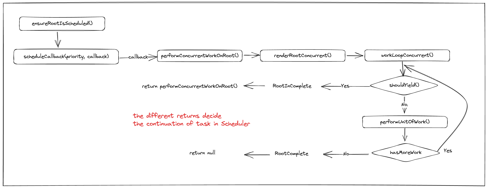

> jser.dev 블로그의 [Scheduler](https://jser.dev/react/2022/03/16/how-react-scheduler-works) 챕터를 보며 번역하고 이해한것을 정리하였습니다.

## 1. React Scheduler는 왜 필요할까

챕터1 [Overview](https://jser.dev/2023-07-11-overall-of-react-internals)에서 살펴봤던 `workLoopSync()` 함수를 살펴보며 Scheduler에 대해 알아보기 시작하자.

```tsx
function workLoopSync() {
  while (workInProgress !== null) {
    performUnitOfWork(workInProgress)
  }
}
```

간략히 정리해보자면 React는 Fiber Tree의 각 Fiber에 대해 내부적으로 작동하고, `WorkInProgress`는 현재 위치를 추적하는 것이며, 순회 알고리즘은 이미 이전 게시물에서 설명했다.

`workLoopSync()`는 동기식이므로 작업이 중단되지 않으므로 이해하기 매우 쉽다. 따라서 React는 while loop에서 계속 작업한다.

단, concurrent mode에서는 상황이 다르다.

```tsx
function workLoopConcurrent() {
  while (workInProgress !== null && !shouldYield()) {
    performUnitOfWork(workInProgress)
  }
}
```

concurrent mode에서는 우선 순위가 높은 작업이 우선 순위가 낮은 작업을 중단할 수 있다. 작업을 중단하고 다시 시작하는 방법이 필요하고 이것이 `shouldYield()`가 하는 일이지만 분명 그 이상이 있다.

## 2. 먼저 몇 가지 배경 지식부터 살펴보자.

### 2.1 Event Loop

Event Loop에 대해서는 사실 [javascript.info의 Event loop](https://javascript.info/event-loop)설명을 읽거나 [Jake Archibald의 영상](https://x.com/jaffathecake/status/961980260194684928)을 시청하는것을 더 추천한다.

그래도 간단히 글로 정리해보자.

1. task 대기열에서 작업(macro task)을 가져와 실행한다.
2. 스케줄링 된 micro tasks가 있다면 실행한다.
3. 렌더링이 필요한지 확인하고 수행한다.
4. task가 더 있으면 단계 1을 반복하거나 추가 작업을 기다린다.

`loop`는 실제로 일종의 loop가 있기 때문에 설명을 할 필요가 있다.

### 2.2 렌더링을 차단하지 않고 새 작업을 예약하려면 `setImmediate()`를 호출한다.

렌더링을 차단하지 않고 일부 task를 스케줄링 하기 위해(위의 3단계), 우리는 이미 `setTimeout(callback, 0)`의 트릭에 익숙하며 새 macro task를 예약한다.

더 나은 API인 `setImmediate()`가 있지만 IE 및 node.js에서만 사용할 수 있다.

이제 React Scheduler의 첫 번째 코드를 다룰 준비가 되었다. [원본 소스코드](https://github.com/facebook/react/blob/e62a8d754548a490c2a3bcff3b420e5eedaf11c0/packages/scheduler/src/forks/Scheduler.js#L550)

```tsx
let schedulePerformWorkUntilDeadline
if (typeof localSetImmediate === "function") {
  // Node.js and old IE.
  // There's a few reasons for why we prefer setImmediate.
  //
  // Unlike MessageChannel, it doesn't prevent a Node.js process from exiting.
  // (Even though this is a DOM fork of the Scheduler, you could get here
  // with a mix of Node.js 15+, which has a MessageChannel, and jsdom.)
  // https://github.com/facebook/react/issues/20756
  //
  // But also, it runs earlier which is the semantic we want.
  // If other browsers ever implement it, it's better to use it.
  // Although both of these would be inferior to native scheduling.
  schedulePerformWorkUntilDeadline = () => {
    localSetImmediate(performWorkUntilDeadline)
  }
} else if (typeof MessageChannel !== "undefined") {
  // DOM and Worker environments.
  // We prefer MessageChannel because of the 4ms setTimeout clamping.
  const channel = new MessageChannel()
  const port = channel.port2
  channel.port1.onmessage = performWorkUntilDeadline
  schedulePerformWorkUntilDeadline = () => {
    port.postMessage(null)
  }
} else {
  // We should only fallback here in non-browser environments.
  schedulePerformWorkUntilDeadline = () => {
    localSetTimeout(performWorkUntilDeadline, 0)
  }
}
```

여기서는 MessageChannel 및 setTimeout을 사용하여 `setImmediate()`의 2가지 대체 방법을 볼 수 있다.

### 2.3 Priority Queue

Priority Queue는 스케줄링을 위한 일반적인 데이터 구조이다. [해당 링크](https://bigfrontend.dev/problem/create-a-priority-queue-in-JavaScript)로 접근하여 JavaScript로 우선 순위 대기열을 직접 만들어 볼 수도 있다.

이는 React의 요구사항에 완벽하게 맞는다. 우선순위가 다른 이벤트가 들어오기 때문에 처리할 우선순위가 가장 높은 이벤트를 빠르게 찾아야 한다.

React는 최소 heap으로 Priority Queue를 구현한다. 관련 소스코드의 [원본 링크](https://github.com/facebook/react/blob/e62a8d754548a490c2a3bcff3b420e5eedaf11c0/packages/scheduler/src/SchedulerMinHeap.js)이다.

## 3. workLoopConcurrent의 Call stack

이제 workLoopConcurrent가 어떻게 호출되는지 살펴보자.



전체 코드는 [ReactFiberWorkLoop.js](https://github.com/facebook/react/blob/e62a8d754548a490c2a3bcff3b420e5eedaf11c0/packages/react-reconciler/src/ReactFiberWorkLoop.old.js)에 있습니다. 코드를 분석해보자.

우리는 `ensureRootIsScheduled()`를 여러 번 본적이 있고 꽤 많은 곳에서 사용되었다. 이름에서 알 수 있듯이, `ensureRootIsScheduled()`는 업데이트가 있는 경우 React가 업데이트를 수행하도록 작업을 예약한다.
